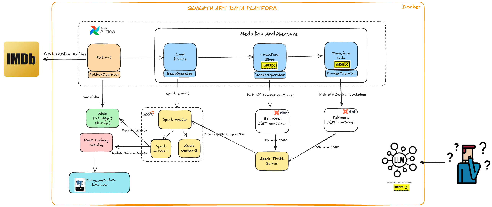
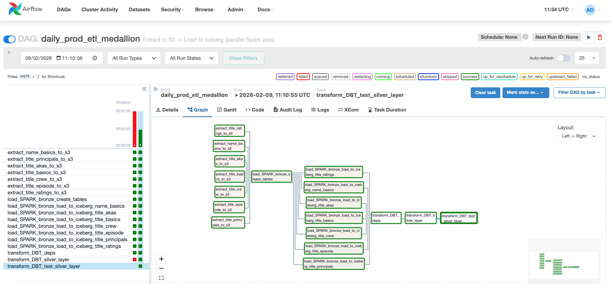
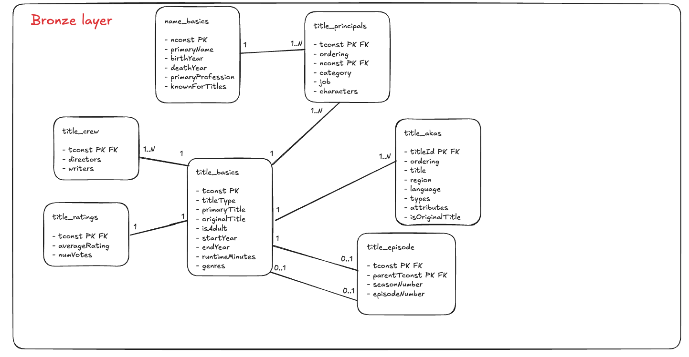
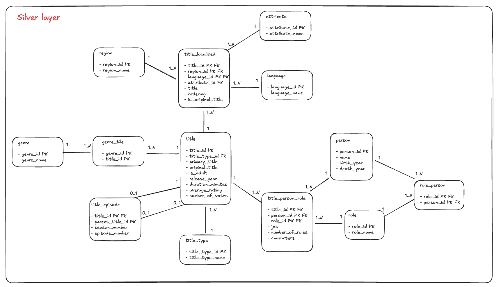

# Seventh Art Data Platfom
The intention with the project is to exercise the Data engineering practises. These are the initial thoughts:

-  **Domain model**: Movies/Series.
-  **Data design pattern**: Medallion Architecture.    
-  **Orchestrator and Scheduler**: Airflow
-  **Data transformation**: PySpark and DBT
-  **Data Storage**: Minio/Iceberg
-  **Metadata Storage**: PostgreSQL
-  **BI/Data Analytics**: Intention to provide AI Text-to-SQL

This is the current state of the data platform:

The list of libraries, frameworks and components are the followig:

## Core Components

| Platform | Component | Version | Comments |
|---------|----------|---------|----------|
| Airflow | Airflow Core | 2.9.3 | |
| Airflow | BashOperator | 2.9.3 | Core operator |
| Airflow | PythonOperator | 2.9.3 | Core operator |
| Airflow | DockerOperator | 3.12.2 | Airflow Docker provider |
| dbt | dbt-core | 1.11.2 | |
| dbt | dbt-spark | 1.10.0rc1 | dbt Spark adapter |
| Spark | Apache Spark | 3.5.5 | |
| Storage | Apache Iceberg | 1.8.1 | Data lake table format (Open Table) |
| Database | PostgreSQL | 14 | Two databases: `airflow` (Airflow metadata) and `catalog_metadata` (Iceberg catalog metadata) |

## Integration & Infrastructure Services

| Category | Service | Version | Comments |
|---------|--------|---------|---------|
| Iceberg Catalog | tabulario/rest-iceberg | 1.6.0 | REST catalog for Iceberg |
| Object Storage | MinIO (minio/minio) | RELEASE.2025-09-07T16-13-09Z-cpuv1 | S3-compatible object storage for data lake |

## Scheduler

- **Airflow**
  

## Data Modeling

- **Bronze layer**

- **Silver layer**

### SQL Exercises
- [50 SQL Questions for Silver Layer](doc/sql_exercises_50_difficult_questions.md) - Comprehensive SQL exercises covering the complete silver layer ER data model (all tables and relationships), designed for practice and RAG system implementation.

## Current Status
- Enriching actors and region/country data.
- Improve DBT data validation.
- Data modelling: Gold Layers (Star schema).
- Migrate to Airflow 3.
- Provide AI Text-to-SQL approach.

